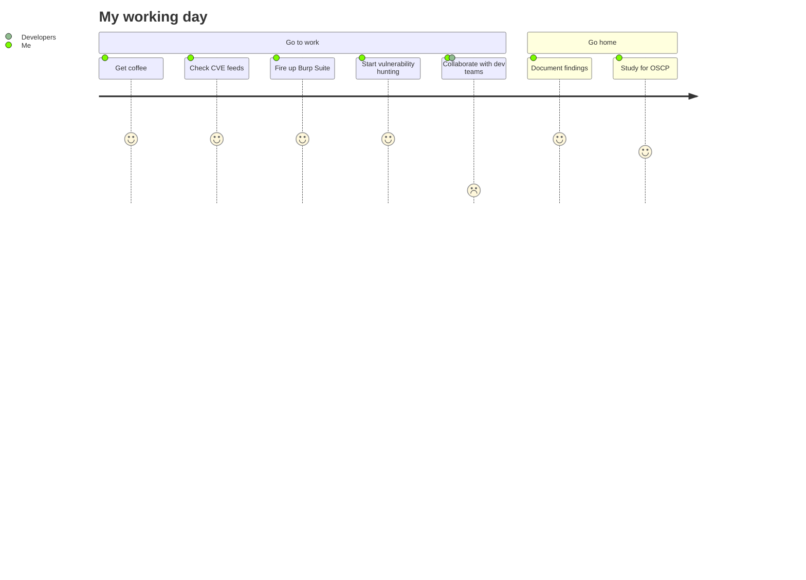

Welcome to my GitHub! I'm passionate about application security, penetration testing, and continuous learning in the ever-evolving world of cybersecurity.

- 🔭 Currently Working On: Pursuing OSCP certification and building cloud security automation tools.
- 🌱 Learning: Advanced red team tactics and DevSecOps practices.
- 👯 Collaborating: Open to all kinds of application security and penetration testing projects.
- 💬 Ask Me About: Anything related to web application security, API testing, or cybersecurity career guidance.
- 📫 Reach Me At: [LinkedIn - Vaibhav Sanwa](https://linkedin.com/in/vaibhav-sanwa) | [Twitter - @n00bh4cker](https://x.com/n00bh4cker)
- ⚡ Fun Fact: I've identified 200+ critical vulnerabilities and helped prevent $2M+ in potential security incidents. Breaking things (ethically) is my passion!

## Featured Projects

- **Cloud Security Assessment Automation:**
[AWS Security Automation](https://github.com/vaibhavsanwa/cloud-security-automation)

- **Vulnerability Management Dashboard:**
[Vuln Management Dashboard](https://github.com/vaibhavsanwa/vuln-dashboard)

- **Custom Security Testing Scripts:**
[Security Testing Scripts](https://github.com/vaibhavsanwa/security-scripts)

- **API Security Testing Framework:**
[API Security Framework](https://github.com/vaibhavsanwa/api-security-framework)

- **Web App Penetration Testing Tools:**
[Web App Pentest Tools](https://github.com/vaibhavsanwa/webapp-pentest-tools)

- **Authentication Bypass Techniques:**
[Auth Bypass Collection](https://github.com/vaibhavsanwa/auth-bypass-techniques)

- **OWASP Testing Automation:**
[OWASP Automated Testing](https://github.com/vaibhavsanwa/owasp-automation)

- **Security Training Materials:**
[Security Training Resources](https://github.com/vaibhavsanwa/security-training)

## Essential Resources

- **Security Testing:**
[OWASP Testing Guide](https://owasp.org/www-project-web-security-testing-guide/)

- **Penetration Testing:**
[PortSwigger Web Security Academy](https://portswigger.net/web-security)

- **Security Techniques:**
[HackTricks](https://book.hacktricks.xyz/)

## YouTube Content

[Application Security Fundamentals](https://www.youtube.com/watch?v=your-video-id)

[API Security Testing Guide](https://www.youtube.com/watch?v=your-video-id)

[OWASP Top 10 Explained](https://www.youtube.com/watch?v=your-video-id)
