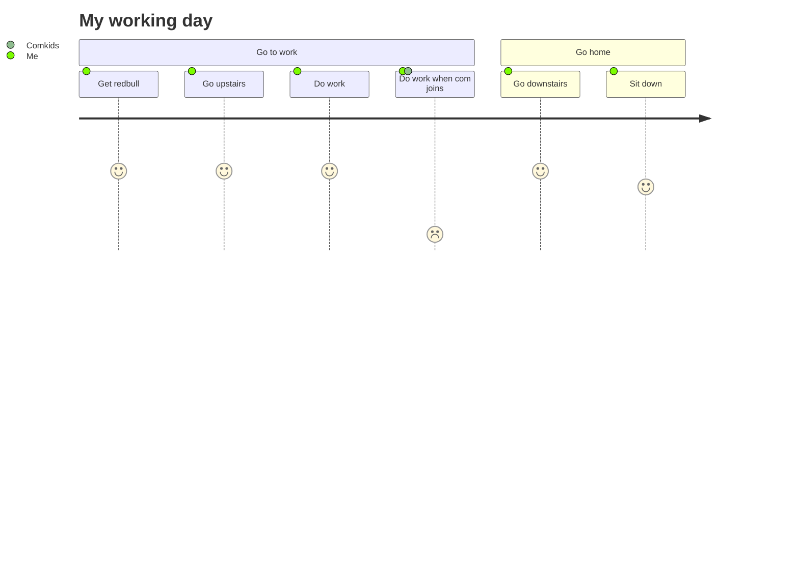

  

  

Welcome to my GitHub! I'm passionate about application security, penetration testing, and continuous learning in the ever-evolving world of cybersecurity.

- 🔭 Currently Working On: Pursuing OSCP certification and building cloud security automation tools.
- 🌱 Learning: Advanced red team tactics and DevSecOps practices.
- 👯 Collaborating: Open to all kinds of application security and penetration testing projects.
- 💬 Ask Me About: Anything related to web application security, API testing, or cybersecurity career guidance.
- 📫 Reach Me At: [LinkedIn - Vaibhav Sanwa](https://linkedin.com/in/vaibhav-sanwa) | [Twitter - @n00bh4cker](https://x.com/n00bh4cker)
- ⚡ Fun Fact: I've identified 200+ critical vulnerabilities and helped prevent $2M+ in potential security incidents. Breaking things (ethically) is my passion!

## Featured Projects

- **Cloud Security Assessment Automation:**
[AWS Security Automation](https://github.com/vaibhavsanwa/cloud-security-automation)

- **Vulnerability Management Dashboard:**
[Vuln Management Dashboard](https://github.com/vaibhavsanwa/vuln-dashboard)

- **Custom Security Testing Scripts:**
[Security Testing Scripts](https://github.com/vaibhavsanwa/security-scripts)

- **API Security Testing Framework:**
[API Security Framework](https://github.com/vaibhavsanwa/api-security-framework)

- **Web App Penetration Testing Tools:**
[Web App Pentest Tools](https://github.com/vaibhavsanwa/webapp-pentest-tools)

- **Authentication Bypass Techniques:**
[Auth Bypass Collection](https://github.com/vaibhavsanwa/auth-bypass-techniques)

- **OWASP Testing Automation:**
[OWASP Automated Testing](https://github.com/vaibhavsanwa/owasp-automation)

- **Security Training Materials:**
[Security Training Resources](https://github.com/vaibhavsanwa/security-training)

## Essential Resources

- **Security Testing:**
[OWASP Testing Guide](https://owasp.org/www-project-web-security-testing-guide/)

- **Penetration Testing:**
[PortSwigger Web Security Academy](https://portswigger.net/web-security)

- **Security Techniques:**
[HackTricks](https://book.hacktricks.xyz/)

  

  

## Ethical Hacker | Penetration Tester | Security Researcher

- [Current project](https://youtube.com/logout?continue=https://googleads.g.doubleclick.net/pcs/click?adurl=https://www.youtube.com/watch?v=dQw4w9WgXcQ)

Welcome to my GitHub! I'm passionate about cybersecurity, ethical hacking, and continuous learning in the ever-evolving world of technology.

- 🔭 **Currently Working On:** A new hacking course with a certificate for completion.
- 🌱 **Learning:** Rust and advanced penetration testing techniques.
- 👯 **Collaborating:** Open to all kinds of penetration testing projects.
- 💬 **Ask Me About:** Anything related to hacking, penetration testing, or cybersecurity.
- 📫 **Reach Me At:** [Discord - HackNexus](https://discord.gg/hacknexus)
- ⚡ **Fun Fact:** I approach everything with a sense of fun and curiosity. Life's too short to be too serious!

### 🤖 Projects I want you to see

- **WSL Seamless mode:** [WSL-Seamless](https://github.com/pentestfunctions/WSL-Seamless)
- **OSINT Master Tool:** [OSINT Automation Test](https://github.com/pentestfunctions/OSINT-MasterTool)
- **Konsole QuickCommands:** [Konsole Quick Commands](https://github.com/pentestfunctions/konsole-quickcommands)
- **Paramfinder** [Param Finder](https://github.com/pentestfunctions/paramfinder)
- **Hackerhelp** [Hacker help](https://github.com/pentestfunctions/hackerhelp)
- **Permissioncheck** [Quickly Check Permissions](https://github.com/pentestfunctions/permissioncheck)
- **Get IPs from Telegram** [Telgram IP Grabber](https://github.com/pentestfunctions/telegram-get-remote-ip)
- **QuickCommands for Windows** [Windows Quick Commands](https://github.com/pentestfunctions/Windows-Terminal-Upgrade)
  
---
Yes I like to use ChatGPT to assist, optimize and prototype ideas and code. 
---

### Languages and Tools:

[![Python][python-shield]][python-url]
[![Rust][rust-shield]][rust-url]
[![Bash][bash-shield]][bash-url]
[![Kali Linux][kali-linux-shield]][kali-linux-url]
[![Metasploit][metasploit-shield]][metasploit-url]
[![C][c-shield]][c-url]
[![C++][cpp-shield]][cpp-url]
[![HTML5][html5-shield]][html5-url]
[![JavaScript][javascript-shield]][javascript-url]
[![CSS3][css3-shield]][css3-url]
[![Node.js][nodejs-shield]][nodejs-url]
[![Wireshark][wireshark-shield]][wireshark-url]
[![Nmap][nmap-shield]][nmap-url]
[![PowerShell][powershell-shield]][powershell-url]
[![Batch][batch-shield]][batch-url]
[![Ruby][ruby-shield]][ruby-url]
[![Perl][perl-shield]][perl-url]

<!-- Shields Links -->
[python-shield]: https://img.shields.io/badge/Python-3776AB?style=for-the-badge&logo=python&logoColor=white
[python-url]: https://python.org
[rust-shield]: https://img.shields.io/badge/Rust-000000?style=for-the-badge&logo=rust&logoColor=white
[rust-url]: https://www.rust-lang.org/
[bash-shield]: https://img.shields.io/badge/Bash-4EAA25?style=for-the-badge&logo=gnu-bash&logoColor=white
[bash-url]: https://www.gnu.org/software/bash/
[kali-linux-shield]: https://img.shields.io/badge/Kali_Linux-557C94?style=for-the-badge&logo=kali-linux&logoColor=white
[kali-linux-url]: https://www.kali.org/
[metasploit-shield]: https://img.shields.io/badge/Metasploit-FF1111?style=for-the-badge&logo=metasploit&logoColor=white
[metasploit-url]: https://www.metasploit.com/
[c-shield]: https://img.shields.io/badge/C-A8B9CC?style=for-the-badge&logo=c&logoColor=white
[c-url]: https://en.wikipedia.org/wiki/C_(programming_language)
[cpp-shield]: https://img.shields.io/badge/C++-00599C?style=for-the-badge&logo=cplusplus&logoColor=white
[cpp-url]: https://isocpp.org/
[html5-shield]: https://img.shields.io/badge/HTML5-E34F26?style=for-the-badge&logo=html5&logoColor=white
[html5-url]: https://html.spec.whatwg.org/
[javascript-shield]: https://img.shields.io/badge/JavaScript-F7DF1E?style=for-the-badge&logo=javascript&logoColor=black
[javascript-url]: https://developer.mozilla.org/en-US/docs/Web/JavaScript
[css3-shield]: https://img.shields.io/badge/CSS3-1572B6?style=for-the-badge&logo=css3&logoColor=white
[css3-url]: https://www.w3.org/Style/CSS/Overview.en.html
[nodejs-shield]: https://img.shields.io/badge/Node.js-339933?style=for-the-badge&logo=nodedotjs&logoColor=white
[nodejs-url]: https://nodejs.org/
[wireshark-shield]: https://img.shields.io/badge/Wireshark-1679A7?style=for-the-badge&logo=wireshark&logoColor=white
[wireshark-url]: https://www.wireshark.org/
[nmap-shield]: https://img.shields.io/badge/Nmap-0E83CD?style=for-the-badge&logo=nmap&logoColor=white
[nmap-url]: https://nmap.org/
[powershell-shield]: https://img.shields.io/badge/PowerShell-5391FE?style=for-the-badge&logo=powershell&logoColor=white
[powershell-url]: https://docs.microsoft.com/en-us/powershell/
[batch-shield]: https://img.shields.io/badge/Batch-4D4D4D?style=for-the-badge&logo=windows&logoColor=white
[batch-url]: https://en.wikipedia.org/wiki/Batch_file
[ruby-shield]: https://img.shields.io/badge/Ruby-CC342D?style=for-the-badge&logo=ruby&logoColor=white
[ruby-url]: https://www.ruby-lang.org/en/
[perl-shield]: https://img.shields.io/badge/Perl-39457E?style=for-the-badge&logo=perl&logoColor=white
[perl-url]: https://www.perl.org/

### 📚 Essential Resources for Penetration Testers

- **Cheat Sheets:** [Pentest Book by Six2dez](https://pentestbook.six2dez.com/)
- **OSINT Tools:** [OSINT Framework](https://osintframework.com/)
- **Hacking Techniques:** [HackTricks](https://book.hacktricks.xyz/)

### 📺 Recommended YouTube Videos

- [The Secret Step-by-Step Guide to Learn Hacking](https://www.youtube.com/watch?v=2TofunAI6fU)
- [How to Pass Your CompTIA A+ Exams](https://www.youtube.com/watch?v=OS9MJjNK6gA&list=PLG49S3nxzAnlGHY8ObL8DiyP3AIu9vd3K)
- [Tailored, Machine Learning-driven Password Guessing Attacks (DefCamp 2018)](https://www.youtube.com/watch?v=iK6ZbD6v9Gg)

### 📈 GitHub Stats

